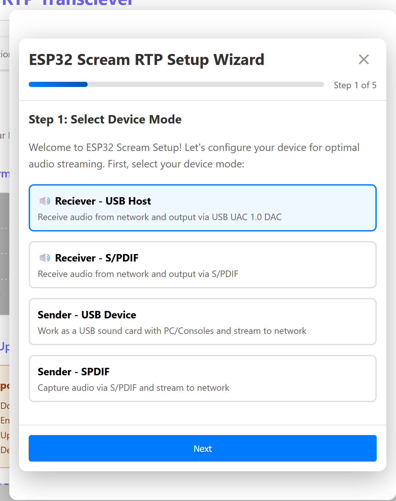
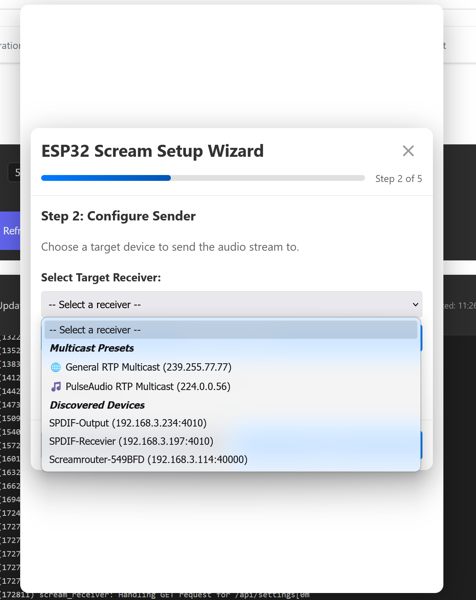
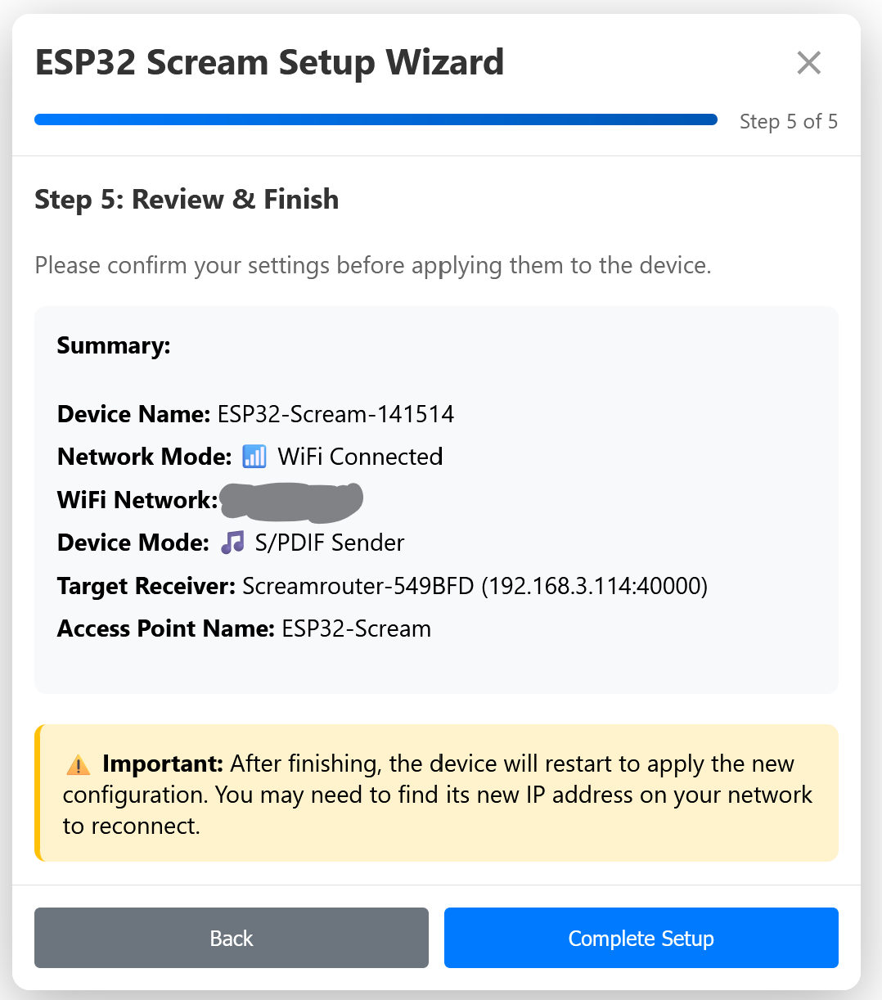
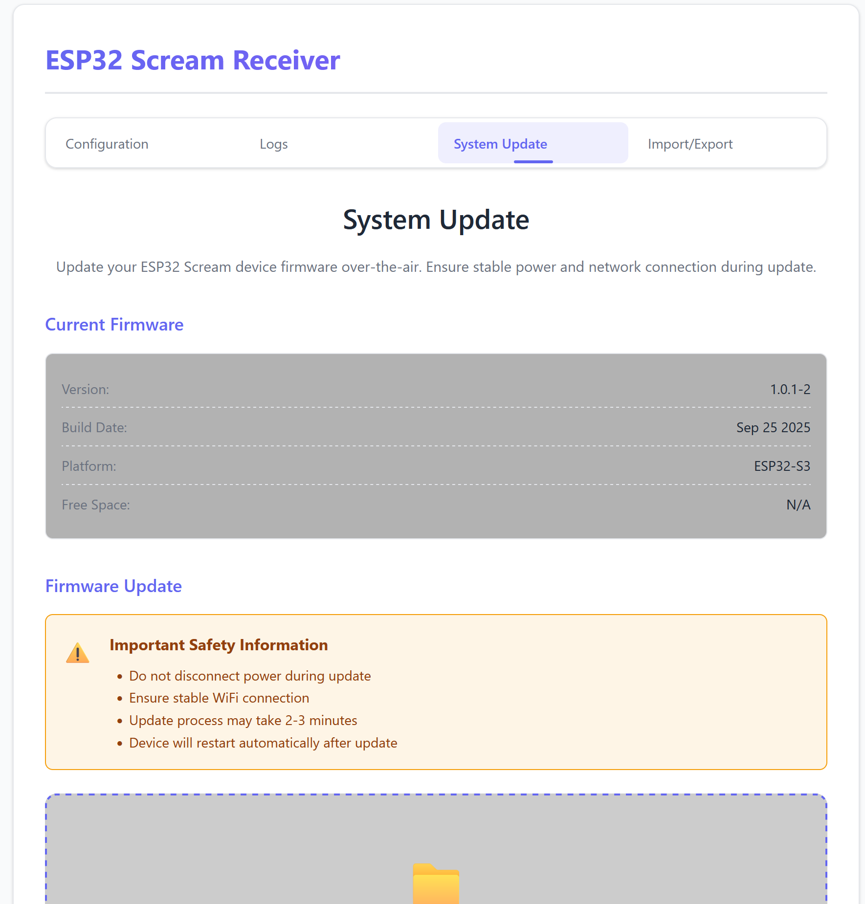
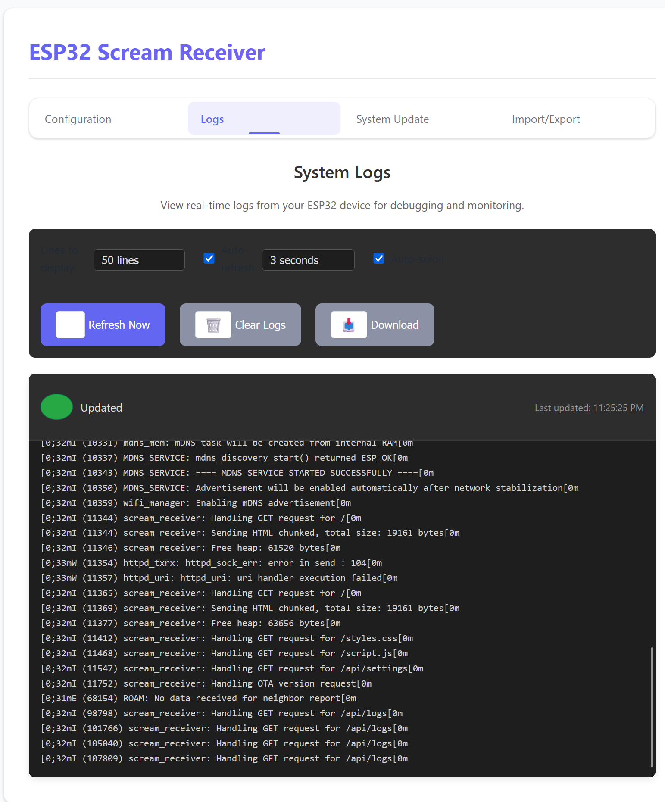

# ESP32 RTP Audio Transceiver
[](https://discord.gg/EXhF6pBhXT)


A versatile audio streaming solution for ESP32 that enables high-quality audio transmission over network using RTP protocol. The device can operate in four distinct modes, bridging different audio interfaces (USB/S/PDIF) with network streaming.

## 📋 Overview

The ESP32 RTP Transceiver is an audio streaming device that transforms your ESP32 into a powerful audio bridge. It supports both sending and receiving audio streams over your local network using the Real-time Transport Protocol (RTP), with support for both USB Audio Class (UAC 1.0) and S/PDIF digital audio interfaces.

Screenshots:

<a href="images/modeselection.png"></a>
<a href="images/discovery.png"></a>
<a href="images/summary.png"></a>
<a href="images/ota.png"></a>
<a href="images/logs.png"></a>

### Key Features

- **Four Operating Modes**: Flexible configuration as sender or receiver with USB or S/PDIF interfaces
- **RTP Protocol**: Industry-standard real-time audio streaming
- **mDNS Discovery**: Automatic device discovery on local networks
- **Web Configuration**: User-friendly web interface with setup wizard
- **OTA Updates**: Over-the-air firmware updates
- **NTP Synchronization**: Precise time synchronization for coordinated playback
- **Adaptive Buffering**: Dynamic buffer management for optimal audio quality
- **Power Management**: Sleep modes and battery charging support (BQ25895)
- **Import/Export Settings**: Backup and restore device configurations

## 🎵 Operating Modes

### 1. USB Receiver Mode
- **Function**: Receives RTP audio streams from the network
- **Output**: USB UAC 1.0 DAC
- **Use Case**: Stream network audio to USB speakers/DACs
- **Description**: Device acts as a network audio receiver, outputting audio through USB to connected DACs or speakers

### 2. S/PDIF Receiver Mode  
- **Function**: Receives RTP audio streams from the network
- **Output**: S/PDIF digital audio
- **Use Case**: Stream network audio to S/PDIF equipment
- **Description**: Device receives network audio and outputs through S/PDIF optical/coaxial connection

### 3. USB Sender Mode
- **Function**: Captures audio from USB host (PC/Console)
- **Output**: RTP network stream
- **Use Case**: Stream PC/console audio to network
- **Description**: Device appears as a USB sound card to computers/consoles and streams received audio to the network

### 4. S/PDIF Sender Mode
- **Function**: Captures audio from S/PDIF input
- **Output**: RTP network stream
- **Use Case**: Stream S/PDIF sources to network
- **Description**: Device captures S/PDIF audio input and broadcasts it as RTP stream on the network

## 🏗️ System Architecture

### Core Components

1. **Lifecycle Manager** (`lifecycle_manager.c`)
   - Central state machine controlling device operation
   - Manages mode transitions and configuration changes
   - Handles power management and sleep states

2. **Web Server** (`web_server.c`)
   - HTTP server for configuration interface
   - REST API endpoints for device control
   - Captive portal for initial setup
   - WebSocket support for real-time updates

3. **Network Components**
   - **RTP Sender** (`network_out.c`): Handles audio streaming to network
   - **RTP Receiver** (`network_in.c`): Receives and processes network audio streams
   - **mDNS Service**: Device discovery and advertisement
   - **NTP Client**: Time synchronization

4. **Audio Interfaces**
   - **USB Host** (`usb_out.c`): USB DAC output support
   - **USB Device** (`usb_in.c`): USB audio capture from host
   - **S/PDIF Input** (`spdif_in.c`): Digital audio capture with clock recovery
   - **S/PDIF Output** (`spdif_out.c`): Digital audio output

5. **Configuration Management**
   - **Config Manager** (`config_manager.c`): Persistent settings storage
   - **WiFi Manager** (`wifi_manager.c`): Network connection management
   - **OTA Manager** (`ota_manager.c`): Firmware update handling

### State Flow

```
INITIALIZING
    ↓
HW_INIT (Hardware initialization, NVS, Power management)
    ↓
STARTING_SERVICES (WiFi, Web server)
    ↓
AWAITING_MODE_CONFIG (Wait for user configuration)
    ↓
[Based on configuration]
    ├── MODE_SENDER_USB
    ├── MODE_SENDER_SPDIF
    ├── MODE_RECEIVER_USB
    └── MODE_RECEIVER_SPDIF
```

## 🚀 Getting Started

### Hardware Requirements

- ESP32-S3 development board
- For USB modes: USB OTG support
- For S/PDIF modes: S/PDIF transceiver hardware
- Optional: BQ25895 battery charger IC
- Optional: TS3USB30ERSWR USB switch

### Initial Setup

1. **Wiring**: Connect SPDIF to data pin 17
2. **Power On**: The device will start in Access Point mode if not configured
3. **Connect**: Join the WiFi network "ESP32-Scream" (default)
4. **Configure**: Navigate to http://192.168.4.1 in your browser
5. **Setup Wizard**: Follow the interactive setup wizard to:
   - Select operating mode
   - Configure network settings
   - Set device name
   - Configure audio parameters

### Factory Reset

Hold GPIO 0 or GPIO 1 during the first 3 seconds of boot to reset all settings to defaults.

## ⚙️ Configuration

### Web Interface

Access the device's IP address in a web browser to access the configuration interface:

- **Configuration Tab**: Setup wizard and quick configuration
- **Logs Tab**: Real-time system logs viewer
- **System Update Tab**: OTA firmware updates
- **Import/Export Tab**: Backup and restore settings

## 📡 Network Discovery

The device supports automatic discovery through mDNS:

- **Service Type**: `_scream._tcp`
- **Advertised Properties**:
  - Device name
  - IP address
  - Port number
  - Operating mode

Compatible with:
- Scream (Windows)
- PulseAudio RTP
- Generic RTP clients (Pipewire, VLC, etc...)

## 🔄 OTA Updates

Firmware updates can be performed through the web interface:

1. Navigate to the "System Update" tab
2. Select or drag the `.bin` firmware file
3. Click "Start Update"
4. Device will automatically restart after successful update

## Battery Support (with BQ25895)
- Battery charging management
- Power status monitoring
- USB power delivery support

## 📊 Technical Specifications

### Network
- **Protocol**: RTP (Real-time Transport Protocol)
- **Transport**: UDP
- **Multicast**: Supported
- **Discovery**: mDNS

### Audio
- **Formats**: PCM 16-bit
- **Sample Rates**: 48kHz
- **Channels**: Stereo

## Installation

### Easy Flash Option (Chrome Browser)

For a quick and easy way to flash pre-built firmware, you can use the web flash tool:

1. Open Chrome browser and navigate to https://screamrouter.net/esp32-flasher
2. Connect your ESP32 device via USB
3. Follow the on-screen instructions to flash the firmware

### Build from Source

#### Prerequisites

- ESP-IDF v5.0 or later
- Python 3.7+

#### Build Steps

```bash
# Clone the repository
git clone https://github.com/your-repo/esp32-rtp
cd esp32-rtp

# Initialize submodules
git submodule update --init --recursive

# Configure the project
idf.py menuconfig

# Build
idf.py build

# Flash to device
idf.py -p /dev/ttyUSB0 flash

# Monitor output
idf.py -p /dev/ttyUSB0 monitor
```

## 🎯 Use Cases

### Home Audio Streaming
- Stream audio from PC to HiFi system
- Wireless speaker systems

### Gaming
- Console audio streaming
- Low-latency game audio
- Wireless gaming headsets

## 🐛 Troubleshooting

### Common Issues

1. **No Audio Output**
   - Check network connectivity
   - Verify port configuration
   - Ensure correct mode selection

2. **Audio Dropouts**
   - Increase buffer sizes
   - Check WiFi signal strength
   - Reduce network congestion

3. **Device Not Discovered**
   - Check firewall/AP settings
   - Ensure same network segment
