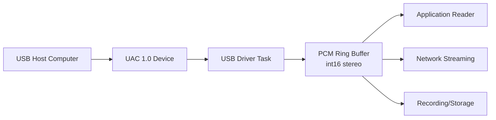

# ESP32 USB Audio Class 1.0 Device Input

High-performance USB Audio Class (UAC) 1.0 device mode implementation for receiving audio from USB hosts. Implements standard USB audio device descriptors and provides 48kHz 16-bit stereo audio output via a FreeRTOS ring buffer for seamless integration with audio pipelines.

Key files:
- [include/usb_in.h](include/usb_in.h)
- [usb_in.c](usb_in.c)
- [idf_component.yml](idf_component.yml)
- [CMakeLists.txt](CMakeLists.txt)

Supported targets and IDF:
- ESP-IDF [>= 5.2] as declared in [idf_component.yml](idf_component.yml)
- Targets: esp32s2, esp32s3, esp32p4 (USB-capable chips only)
- Repository: [https://github.com/netham45/esp32-usb-in](https://github.com/netham45/esp32-usb-in)


## Data Flow




## Features
- USB Audio Class 1.0 compliant device implementation
- Fixed 48kHz sample rate, 16-bit stereo audio format
- Zero-copy PCM data transport via FreeRTOS ring buffer
- Automatic USB enumeration and audio streaming handling
- Connection status monitoring via [usb_in_is_connected()](include/usb_in.h#L35)
- Interleaved PCM output: writes [left,right] 16-bit samples as pairs
- Direct ring buffer access for efficient batch processing
- Helper functions for simplified audio reading


## Hardware Requirements
- ESP32 variant with USB OTG support:
  - ESP32-S2: USB OTG via GPIO19/20
  - ESP32-S3: USB OTG via GPIO19/20 or external PHY
  - ESP32-P4: Native USB support
- USB connection to host computer (PC, Mac, Linux, Android)
- No external components required for ESP32-S2/S3 (uses internal USB PHY)


## Quick Start

1) Initialize and start the USB audio device

```c
#include "usb_in.h"

static void on_usb_ready(void) {
    ESP_LOGI(TAG, "USB Audio device ready");
}

void app_main(void) {
    // Initialize USB audio device with callback
    ESP_ERROR_CHECK(usb_in_init(on_usb_ready));    // [usb_in_init()](include/usb_in.h#L30)
    
    // Start USB audio device (begins enumeration)
    ESP_ERROR_CHECK(usb_in_start());               // [usb_in_start()](include/usb_in.h#L31)
}
```

2) Wait for USB connection and read PCM data

```c
// Wait for USB host connection
while (!usb_in_is_connected()) {
    vTaskDelay(pdMS_TO_TICKS(100));               // [usb_in_is_connected()](include/usb_in.h#L35)
}

// Method 1: Use the helper reader for simple reads
uint8_t audio_buffer[USB_CHUNK_SIZE];
int bytes_read = usb_in_read(audio_buffer, sizeof(audio_buffer)); // [usb_in_read()](include/usb_in.h#L37)
if (bytes_read > 0) {
    // Process audio_buffer containing interleaved L/R samples
    process_audio(audio_buffer, bytes_read);
}

// Method 2: Direct ring buffer access for batch processing
RingbufHandle_t ringbuf = usb_in_get_ringbuf();   // [usb_in_get_ringbuf()](include/usb_in.h#L55)
size_t item_size = 0;
uint8_t* data = (uint8_t*) xRingbufferReceiveUpTo(
    ringbuf, &item_size, pdMS_TO_TICKS(20), USB_CHUNK_SIZE);
if (data) {
    // data contains interleaved int16 little-endian [L,R] frames
    process_audio(data, item_size);
    vRingbufferReturnItem(ringbuf, data);
}
```

3) Stop and cleanup when done

```c
ESP_ERROR_CHECK(usb_in_stop());    // [usb_in_stop()](include/usb_in.h#L32)
usb_in_deinit();                   // [usb_in_deinit()](include/usb_in.h#L33)
```


## API Reference

### Initialization and Control
- [usb_in_init()](include/usb_in.h#L30): Initialize USB audio device with optional completion callback. Creates PCM ring buffer and prepares USB stack.
- [usb_in_start()](include/usb_in.h#L31): Start USB audio device and begin enumeration process. Audio streaming begins when host selects the device.
- [usb_in_stop()](include/usb_in.h#L32): Stop USB audio device and disconnect from host.
- [usb_in_deinit()](include/usb_in.h#L33): Cleanup all resources. Safe to call after stop.

### Status and Information
- [usb_in_get_sample_rate()](include/usb_in.h#L34): Returns current sample rate (always 48000 Hz).
- [usb_in_is_connected()](include/usb_in.h#L35): Returns true if USB host is connected and streaming.

### Data Access
- [usb_in_read()](include/usb_in.h#L37): Inline helper to read up to `size` bytes from PCM buffer. Returns actual bytes read.
- [usb_in_get_ringbuf()](include/usb_in.h#L55): Returns the PCM ring buffer handle for direct FreeRTOS ring buffer operations.


## Configuration Constants

| Constant | Value | Description |
|----------|-------|-------------|
| [USB_SAMPLE_RATE](include/usb_in.h#L16) | 48000 | Fixed sample rate in Hz |
| [USB_CHANNEL_NUM](include/usb_in.h#L17) | 2 | Number of audio channels (stereo) |
| [USB_BIT_DEPTH](include/usb_in.h#L18) | 16 | Bits per sample |
| [USB_BYTES_PER_SAMPLE](include/usb_in.h#L19) | 2 | Bytes per sample (16-bit) |
| [USB_CHUNK_SIZE](include/usb_in.h#L20) | 1152 | USB transfer chunk size in bytes |
| [USB_BUFFER_SIZE](include/usb_in.h#L21) | 2304 | Internal USB buffer (2 chunks) |
| [USB_TASK_STACK_SIZE](include/usb_in.h#L22) | 4096 | USB task stack size in bytes |
| [USB_TASK_PRIORITY](include/usb_in.h#L23) | 5 | USB task priority (high) |
| [PCM_BUFFER_SIZE](include/usb_in.h#L24) | 8192 | PCM ring buffer size in bytes |


## PCM Data Format

### Frame Structure
- Interleaved stereo little-endian int16 frames: [L0,R0,L1,R1,...]
- Each sample is 16-bit signed integer (-32768 to +32767)
- Frame size: 4 bytes (2 bytes left + 2 bytes right)
- Byte order: Little-endian

### Buffer Capacity
- With [PCM_BUFFER_SIZE](include/usb_in.h#L24)=8192:
  - Holds 2048 stereo frames
  - ~42.7ms of audio at 48kHz
  - Provides sufficient buffering for network streaming

### Data Rate
- 48000 samples/sec × 2 channels × 2 bytes = 192,000 bytes/sec
- [USB_CHUNK_SIZE](include/usb_in.h#L20)=1152 bytes = 6ms of audio
- Optimized for low-latency audio streaming


## Example Usage Scenarios

### Audio Streaming to Network
```c
void audio_streaming_task(void *pvParameters) {
    uint8_t chunk[USB_CHUNK_SIZE];
    
    while (1) {
        if (usb_in_is_connected()) {
            int bytes = usb_in_read(chunk, sizeof(chunk));
            if (bytes > 0) {
                // Send to network (RTP, WebSocket, etc.)
                network_send_audio(chunk, bytes);
            }
        }
        vTaskDelay(pdMS_TO_TICKS(5));
    }
}
```

### Audio Recording to SD Card
```c
void recording_task(void *pvParameters) {
    FILE *file = fopen("/sdcard/recording.pcm", "wb");
    RingbufHandle_t ringbuf = usb_in_get_ringbuf();
    
    while (recording_active) {
        size_t size = 0;
        uint8_t *data = xRingbufferReceiveUpTo(
            ringbuf, &size, pdMS_TO_TICKS(100), 4096);
        if (data) {
            fwrite(data, 1, size, file);
            vRingbufferReturnItem(ringbuf, data);
        }
    }
    fclose(file);
}
```

### Real-time Audio Processing
```c
void process_audio_task(void *pvParameters) {
    int16_t stereo_frame[2];
    
    while (1) {
        if (usb_in_read((uint8_t*)stereo_frame, 4) == 4) {
            // Apply DSP, effects, etc.
            int16_t left = stereo_frame[0];
            int16_t right = stereo_frame[1];
            
            // Example: Apply gain
            left = (left * gain) >> 8;
            right = (right * gain) >> 8;
            
            // Output processed audio
            audio_out_write(left, right);
        }
    }
}
```


## Dependencies

### Required Components
- `espressif/usb_device_uac` (>= 1.0.0) - USB Audio Class implementation
- ESP-IDF USB Device stack
- FreeRTOS (included with ESP-IDF)

### Component Declaration
From [idf_component.yml](idf_component.yml):
```yaml
dependencies:
  espressif/usb_device_uac: "^1.0.0"
  idf: ">=5.2"
targets:
  - esp32s2
  - esp32s3
  - esp32p4
```


## Threading and Resource Usage

### Task Configuration
- USB driver task created with:
  - Stack size: [USB_TASK_STACK_SIZE](include/usb_in.h#L22) (4096 bytes)
  - Priority: [USB_TASK_PRIORITY](include/usb_in.h#L23) (5 - high priority)
  - Core affinity: No specific core (scheduler decides)

### Memory Usage
- PCM ring buffer: [PCM_BUFFER_SIZE](include/usb_in.h#L24) (8192 bytes)
- USB internal buffer: [USB_BUFFER_SIZE](include/usb_in.h#L21) (2304 bytes)
- Task stack: 4096 bytes
- Total heap usage: ~15KB including USB stack overhead

### CPU Impact
- Minimal CPU usage during streaming (~2-5%)
- Interrupt-driven USB transfers
- Efficient ring buffer operations


## Troubleshooting

### USB Device Not Recognized
- Verify ESP32 variant supports USB (S2/S3/P4 only)
- Check USB cable supports data (not charge-only)
- Ensure GPIO19/20 are not used by other peripherals
- Review USB descriptors in device manager/system info

### No Audio Data Received
- Confirm [usb_in_is_connected()](include/usb_in.h#L35) returns true
- Check host audio output is directed to ESP32 USB Audio device
- Verify host volume is not muted
- Ensure ring buffer reads are aligned to 4-byte frames

### Audio Glitches or Dropouts
- Increase [PCM_BUFFER_SIZE](include/usb_in.h#L24) for more buffering
- Ensure reader task has sufficient priority
- Check for CPU overload (use `vTaskGetRunTimeStats()`)
- Verify USB cable quality and length (<2m recommended)

### Host Compatibility Issues
- Windows: May require manual driver selection in Device Manager
- macOS: Should work automatically as USB Audio Class device
- Linux: Check ALSA/PulseAudio recognizes device (`aplay -l`)
- Android: Requires OTG support and USB audio routing app


## Limitations
- Fixed 48kHz sample rate (no rate adaptation)
- 16-bit depth only (24-bit not supported)
- Stereo only (no mono or multi-channel)
- UAC 1.0 only (UAC 2.0 features not available)
- No audio controls (volume, mute handled by host)
- No feedback endpoint (relies on host clock)


## Version and Metadata
- Component version: 1.0.0
- Repository: [https://github.com/netham45/esp32-usb-in](https://github.com/netham45/esp32-usb-in)
- License: MIT
- Author: netham45